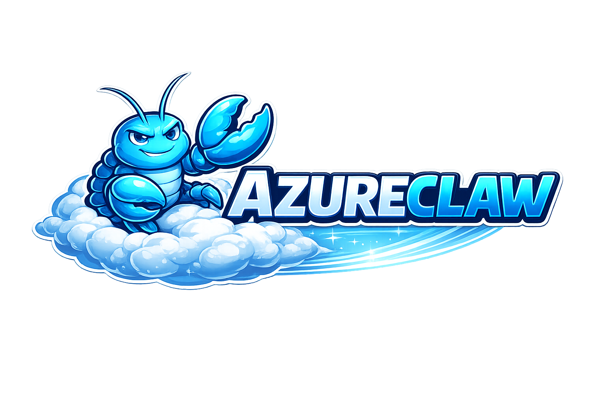
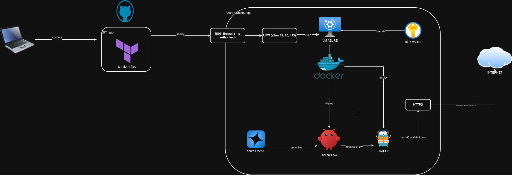

<div align="center">
  
</div>

# terraform-azurerm-openclaw

[](https://opensource.org/licenses/MIT)
[](https://www.terraform.io/)
[](https://registry.terraform.io/providers/hashicorp/azurerm/latest)

**Terraform module for deploying [OpenClaw](https://github.com/openclaw/openclaw) on Azure.**

Inspired by [openclaw-terraform-hetzner](https://github.com/andreesg/openclaw-terraform-hetzner) — adapted for Azure.

---

## Why Azure?

Hosting OpenClaw on Azure unlocks integrations that aren't possible on a generic VPS:

- **Microsoft Teams bot** — expose OpenClaw as a Teams channel; your colleagues interact with the AI agent directly from Teams without any extra tool
- **Azure OpenAI** — use GPT-4o or GPT-4.1 models billed to your existing Azure subscription, without going through Anthropic or OpenAI directly
- **Office 365 identity** — authenticate users via Azure AD (Entra ID), so access is tied to your org's SSO and conditional access policies
- **Private networking** — deploy into an existing VNet and keep all traffic inside your Azure tenant, away from the public internet
- **Compliance & sovereignty** — data stays in your Azure region; useful for orgs with data residency requirements (GDPR, HDS, etc.)
- **Managed secrets** — API keys live in Azure Key Vault, fetched at boot via Managed Identity — no credentials in config files or CI pipelines

This module automates the full deployment: VM, networking, Key Vault, Docker stack, and security hardening — all in one `make apply`.

---

## Architecture



---

## What gets deployed

### Azure resources

| Resource | Name pattern | Notes |
|----------|-------------|-------|
| Resource Group | `rg-openclaw` | Configurable |
| Virtual Network | `vnet-openclaw` | 10.0.0.0/16 |
| Subnet | `snet-openclaw` | 10.0.1.0/24 |
| NSG | `nsg-openclaw` | SSH only by default + DenyAll catch-all |
| Public IP | `pip-openclaw` | Static, Standard SKU |
| NIC | `nic-openclaw` | |
| VM | `vm-openclaw` | Ubuntu 24.04 LTS, Premium_LRS disk |
| Key Vault | `kv-openclaw-<random>` | RBAC, soft-delete, purge protection |

### VM stack (installed by cloud-init on first boot)

| Layer | Component | Notes |
|-------|-----------|-------|
| Security | UFW | 22/80/443 inbound, deny all |
| Security | fail2ban | SSH jail: 5 retries → 1h ban |
| Security | SSH hardening | Key-only, no root, MaxAuthTries 3 |
| Runtime | Docker CE + Compose | Container runtime |
| Proxy | Traefik v3.3 | Reverse proxy, TLS, Let's Encrypt |
| App | OpenClaw Gateway | AI agent gateway |

### Security posture — Docker ports

All internal ports are bound to `127.0.0.1` (loopback), not `0.0.0.0`. Docker bypasses UFW via iptables; loopback binding ensures ports are unreachable from outside even if NSG rules changed.

| Port | Binding | Accessible from |
|------|---------|-----------------|
| 80 | `0.0.0.0` | Internet (HTTP → HTTPS redirect) |
| 443 | `0.0.0.0` | Internet (TLS) |
| 18789 | `127.0.0.1` | SSH tunnel only |
| 8080 | `127.0.0.1` | SSH tunnel only (Traefik dashboard) |

---

## Quick start

```bash
# 1. Clone
git clone https://github.com/YOUR_ORG/terraform-azurerm-openclaw.git
cd terraform-azurerm-openclaw

# 2. Configure
cp terraform.tfvars.example terraform.tfvars
# Edit terraform.tfvars — set subscription_id, ssh_allowed_cidrs, llm_provider

# 3. Pass secrets via env vars (never hardcode in tfvars)
export TF_VAR_anthropic_api_key="sk-ant-..."      # if llm_provider = anthropic
export TF_VAR_azure_openai_api_key="..."           # if llm_provider = azure-openai

# 4. Deploy
make init
make apply

# 5. Save the auto-generated SSH key
make save-key

# 6. Wait for cloud-init (~5 min)
make cloud-init-status

# 7. Access OpenClaw
make tunnel        # SSH tunnel → http://localhost:18789
```

### Get the gateway token

```bash
ssh -i ~/.ssh/openclaw.pem openclaw@<VM_IP> \
  'grep OPENCLAW_GATEWAY_TOKEN ~/openclaw/.env | cut -d= -f2'
```

---

## LLM providers

### Anthropic (default)

```hcl
llm_provider      = "anthropic"
anthropic_api_key = ""   # pass via TF_VAR_anthropic_api_key
```

The API key is stored in Key Vault and fetched at boot via managed identity.

### Azure OpenAI (direct)

OpenClaw connects directly to Azure OpenAI using the OpenAI Chat Completions API. No proxy required.

```hcl
llm_provider             = "azure-openai"
azure_openai_endpoint    = "https://YOUR_RESOURCE.openai.azure.com/openai/v1"
azure_openai_api_key     = ""              # pass via TF_VAR_azure_openai_api_key
azure_openai_deployment  = "my-deployment-name"
```

What gets configured automatically:
- `models.providers.azure-openai-responses` written into `openclaw.json` at first boot
- API key stored in Key Vault, fetched at boot via managed identity, injected into the config
- OpenClaw calls `YOUR_RESOURCE.openai.azure.com/openai/v1` directly with `api-key` header auth

### OpenAI

```hcl
llm_provider = "openai"
```

Set `OPENAI_API_KEY` manually on the VM after deploy (`make ssh`).

---

## Access methods

### SSH tunnel (default — most secure)

Port 18789 is only accessible via SSH tunnel. Nothing is publicly exposed except SSH (restricted to your IP).

```bash
make tunnel
# Gateway at http://localhost:18789

make tunnel-https
# https://openclaw.local:8443 (add to /etc/hosts: 127.0.0.1 openclaw.local)
# Traefik dashboard at http://localhost:8080
```

### Public HTTPS with Let's Encrypt

To expose OpenClaw at a real public domain with a valid TLS certificate:

```hcl
enable_public_https = true
public_domain       = "openclaw.example.com"
acme_email          = "you@example.com"
```

Prerequisites:
1. Create a DNS A record pointing `public_domain` → VM public IP
2. Set `acme_email` (required for Let's Encrypt)
3. `terraform apply` — NSG opens 80/443 automatically

Traefik handles certificate issuance and renewal via HTTP challenge.

### Tailscale (zero-trust)

```hcl
enable_tailscale   = true
tailscale_auth_key = "tskey-auth-..."
```

Joins the VM to your Tailscale network. You can then restrict or remove public SSH exposure.

### Microsoft Teams

```hcl
enable_teams     = true
ms_app_id        = ""   # Azure AD App Registration client ID
ms_app_password  = ""   # pass via TF_VAR_ms_app_password
teams_bot_domain = "openclaw.example.com"
teams_acme_email = "you@example.com"
```

Run `make teams-manifest` after deploy to generate the Teams app package.

---

## Secrets management

**Never put API keys in `terraform.tfvars`.**

```bash
export TF_VAR_anthropic_api_key="sk-ant-..."
export TF_VAR_azure_openai_api_key="..."
export TF_VAR_ms_app_password="..."
export ARM_SUBSCRIPTION_ID="xxxxxxxx-xxxx-xxxx-xxxx-xxxxxxxxxxxx"
```

With `enable_key_vault = true` (default):
1. Terraform writes the API key to Key Vault (Secrets Officer role)
2. The raw key is **never written to disk on the VM during provisioning**
3. At boot, the VM fetches it via IMDS + managed identity (Secrets User, read-only)
4. The key is injected into `openclaw.json` (for azure-openai) or `~/openclaw/.env` (for anthropic)

```bash
make kv-set NAME=azure-openai-api-key VALUE=...   # Update a Key Vault secret
```

---

## Configuration reference

| Variable | Default | Description |
|----------|---------|-------------|
| `subscription_id` | required | Azure subscription ID |
| `location` | `westeurope` | Azure region |
| `resource_group_name` | `rg-openclaw` | Resource group name |
| `vm_size` | `Standard_B2ms` | VM size (2 vCPU / 8 GB recommended) |
| `os_disk_size_gb` | `30` | OS disk size |
| `admin_username` | `openclaw` | SSH admin username |
| `ssh_public_key` | `""` | Leave empty to auto-generate (`make save-key`) |
| `ssh_allowed_cidrs` | required | **Restrict to your IP** — e.g. `["1.2.3.4/32"]` |
| `expose_gateway` | `false` | Open port 18789 publicly (not recommended) |
| `enable_key_vault` | `true` | Store API keys in Key Vault |
| `openclaw_version` | `latest` | Git tag to install — pin for prod (e.g. `v1.2.0`) |
| **LLM** | | |
| `llm_provider` | `anthropic` | `anthropic` \| `azure-openai` \| `openai` |
| `anthropic_api_key` | `""` | Stored in Key Vault — use `TF_VAR_` env var |
| `azure_openai_endpoint` | `""` | Required when `llm_provider = azure-openai` |
| `azure_openai_api_key` | `""` | Stored in Key Vault — use `TF_VAR_` env var |
| `azure_openai_deployment` | `""` | Azure OpenAI deployment name |
| **Public HTTPS** | | |
| `enable_public_https` | `false` | Expose OpenClaw publicly with Let's Encrypt TLS |
| `public_domain` | `""` | Domain pointing to VM IP (e.g. `openclaw.example.com`) |
| `acme_email` | `""` | Email for Let's Encrypt notifications |
| **Tailscale** | | |
| `enable_tailscale` | `false` | Install Tailscale for zero-trust access |
| `tailscale_auth_key` | `""` | `tskey-auth-...` |
| **Teams** | | |
| `enable_teams` | `false` | Enable Microsoft Teams integration |
| `ms_app_id` | `""` | Azure AD App Registration client ID |
| `ms_app_password` | `""` | Client secret — use `TF_VAR_` env var |
| `teams_bot_domain` | `""` | Public domain for the bot endpoint |
| `teams_acme_email` | `""` | Email for Let's Encrypt (Teams TLS) |
| **Tags** | | |
| `project_name` | `openclaw` | Used in resource names and tags |
| `environment` | `prod` | `dev` \| `staging` \| `prod` |

---

## Cost estimate

| VM Size | vCPU | RAM | ~EUR/month |
|---------|------|-----|------------|
| Standard_B2s | 2 | 4 GB | ~37€ |
| **Standard_B2ms** | **2** | **8 GB** | **~67€** (recommended) |
| Standard_B4ms | 4 | 16 GB | ~134€ |

Stop the VM when not in use — you pay only for the disk (~5€/month):

```bash
az vm deallocate --resource-group rg-openclaw --name vm-openclaw
az vm start      --resource-group rg-openclaw --name vm-openclaw
```

---

## Day-2 operations

```bash
make status          # Container status
make logs            # Stream gateway logs
make deploy          # Pull latest image & restart
make restart         # Restart containers
make stop            # Stop containers
make dashboard       # Get OpenClaw dashboard token URL
make pair-list       # List pending device pairing requests
make pair-approve ID=<id>   # Approve a pairing request

make backup          # Backup ~/.openclaw/ to ./backups/
make restore BACKUP=backups/openclaw-backup-xxx.tar.gz
make push-env        # Push .env.production to VM (dev — bypasses Key Vault)
make kv-set NAME=<secret-name> VALUE=<value>   # Update Key Vault secret

make cloud-init-log      # Full cloud-init output
make cloud-init-status   # cloud-init status summary
make openclaw-log        # OpenClaw first-boot log
```

---

## Security summary

| Layer | Mechanism | Notes |
|-------|-----------|-------|
| Network | Azure NSG | SSH restricted to `ssh_allowed_cidrs`; DenyAll catch-all |
| Network | UFW | 22/80/443 inbound; deny all else |
| Network | Port binding | Internal ports on `127.0.0.1` — Docker/UFW bypass mitigated |
| VM | SSH hardening | Key-only, no root, MaxAuthTries 3 |
| VM | fail2ban | 5 retries → 1h ban, SSH jail |
| Containers | cap_drop: ALL | All Linux capabilities dropped |
| Containers | no-new-privileges | Privilege escalation blocked |
| Containers | read_only | Gateway filesystem read-only + tmpfs /tmp |
| Secrets | Key Vault | RBAC only, soft-delete 30d, purge protection |
| Secrets | Managed identity | VM reads Key Vault at boot — no credentials on disk |
| IaC | `prevent_destroy` | VM and Key Vault protected from accidental destroy |
| IaC | `.gitignore` | `terraform.tfvars`, `*.tfstate`, `*.pem` excluded |

---

## Troubleshooting

**Browser shows "pairing required" after entering the token**

Expected on first connection. Each browser/device must be approved:

```bash
make pair-list
make pair-approve ID=<request-id>
```

**`origin not allowed` error in browser**

Add your domain to the allowed origins on the VM:

```bash
ssh -i ~/.ssh/openclaw.pem openclaw@<IP> "cd ~/openclaw && \
  docker compose run --rm openclaw-cli config set \
  gateway.controlUi.allowedOrigins '[\"https://YOUR_DOMAIN\"]' --strict-json"
```

**Gateway not accessible after `make tunnel`**

1. Verify the tunnel is active (keep the terminal open)
2. `make status` — check container health
3. `make logs` — check gateway errors

**Azure OpenAI not responding (azure-openai mode)**

Check that the API key and provider config were written correctly at first boot:

```bash
make openclaw-log    # should show "Azure OpenAI provider configured in openclaw.json"
ssh -i ~/.ssh/openclaw.pem openclaw@<IP> \
  "cat ~/.openclaw/openclaw.json | python3 -m json.tool | grep -A3 azure"
```

**Key Vault `prevent_destroy` blocks `terraform destroy`**

By design. To remove:
1. Remove `lifecycle { prevent_destroy = true }` in `keyvault.tf`
2. `terraform destroy`
3. Key Vault enters soft-delete for 30 days (purge protection)

---

## File structure

```
.
├── versions.tf        # Terraform + provider requirements
├── data.tf            # Data sources (current Azure client config)
├── network.tf         # Resource group, VNet, subnet, NSG, public IP, NIC
├── keyvault.tf        # Key Vault, secrets, RBAC
├── compute.tf         # SSH key, VM, RBAC for VM managed identity
├── locals.tf          # Tags, cloud-init template rendering, computed locals
├── variables.tf       # All input variables with validations
├── outputs.tf         # SSH command, tunnel command, gateway URL
├── cloud-init.yaml    # VM bootstrap: Docker, security, OpenClaw setup
├── docker-compose.yml # Local dev compose reference
├── traefik/           # Traefik static and dynamic config (local dev)
├── ARCHITECTURE.md    # Detailed architecture + security documentation
└── Makefile           # Day-2 operations
```

---

## License

MIT — see [LICENSE](LICENSE).

## Credits

- [openclaw-terraform-hetzner](https://github.com/andreesg/openclaw-terraform-hetzner) by @andreesg — original inspiration
- [OpenClaw](https://github.com/openclaw/openclaw) by Peter Steinberger
